## Part 1. Installation of the OS
1. Check Ubuntu version by running the command \
  `cat /etc/issue`

2. Add a screenshot of the command output to the report.

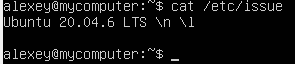

## Part 2. Creating a user
1. Add a screenshot of command call to create user.

2. The new user must be in the output of the command: \
  `cat /etc/passwd`
  
3. Add a screenshot of the command output.

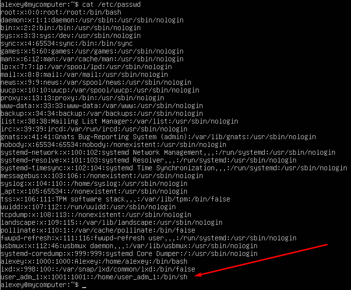

## Part 3. Setting up the OS network
1. Set the machine name as user-1
         
- sudo vim /etc/hostname
- sudo vim /etc/hosts
- sudo reboot        
   
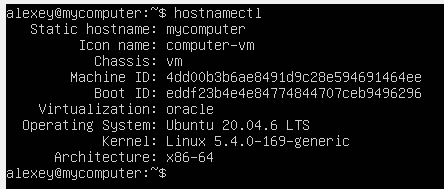  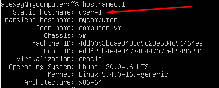  

2. Set the time zone corresponding to your current location.

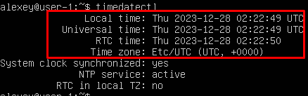 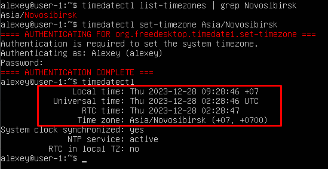

3. Output the names of the network interfaces using a console command.

- sudo apt install net-tools

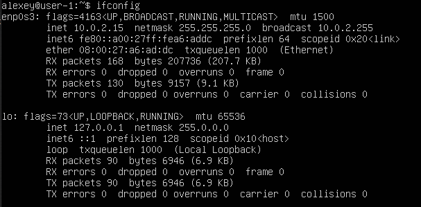

- lo (loopback device) – виртуальный интерфейс, присутствующий по умолчанию в любом Linux. Он используется для отладки сетевых программ и запуска серверных приложений на локальной машине. С этим интерфейсом всегда связан адрес 127.0.0.1. У него есть dns-имя – localhost.

4. Use the console command to get the ip address of the device you are working on from the DHCP server.

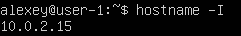

- Протокол динамической конфигурации узлов (Dynamic Host Configuration Protocol, DHCP) — это сетевой протокол, используемый для автоматического получения узлами IP-адресов и сетевой конфигурации с сервера.

5. Define and display the external ip address of the gateway (ip) and the internal IP address of the gateway, aka default ip address (gw).

* внешний ip-адрес шлюза (ip):    

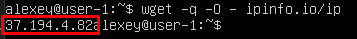

* внутренний IP-адрес шлюза:    

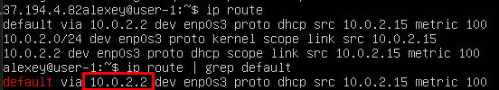

6. Set static (manually set, not received from DHCP server) ip, gw, dns settings (use public DNS servers, e.g. 1.1.1.1 or 8.8.8.8).

- sudo vim /etc/netplan/*.yaml

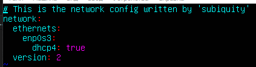 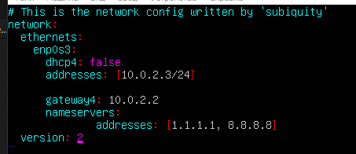  

7. Reboot the virtual machine. Make sure that the static network settings (ip, gw, dns) correspond to those set in the previous point.

- reboot

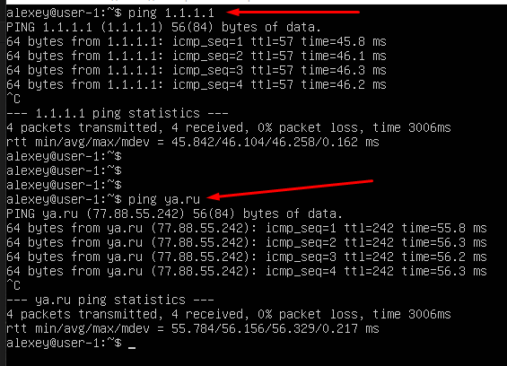

## Part 4. OS Update
1. Update the system packages to the latest version

- sudo apt update
- sudo apt dist-upgrade
- sudo reboot

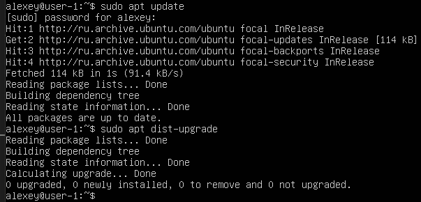

## Part 5. Using the **sudo** command

1. ##### Allow user created in [Part 2](#part-2-creating-a-user) to execute sudo command.

* Sudo — это утилита, предоставляющая привилегии root для выполнения административных операций в соответствии со своими настройками. Она позволяет легко контролировать доступ к важным приложениям в системе. По умолчанию, при установке Ubuntu первому пользователю (тому, который создаётся во время установки) предоставляются полные права на использование sudo. Т.е. фактически первый пользователь обладает той же свободой действий, что и root.

- sudo vim /etc/hostname
- sudo vim /etc/hosts
- sudo reboot 

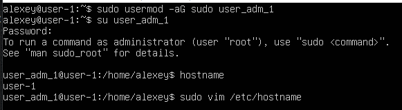

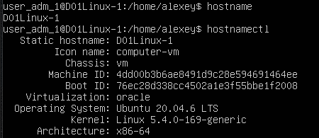

## Part 6. Installing and configuring the time service

1. Set up the automatic time synchronisation service.

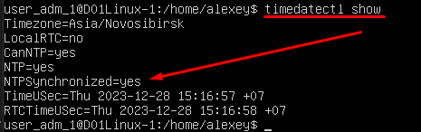

## Part 7. Installing and using text editors

1. Install **VIM** text editor (+ any two others if you like **NANO**, **MCEDIT**, **JOE** etc.)

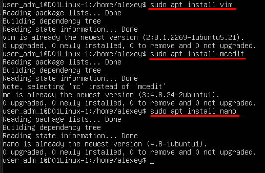

2. Using each of the three selected editors, create a *test_X.txt* file, where X is the name of the editor in which the file is created. Write your nickname in it, close the file and save the changes.

* vim test_VIM.txt
* vim test_NANO.txt
* vim test_MCEDIT.txt

- VIM (ESC -> :wq -> ENTER)
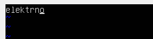
- NANO (CTRL+O -> ENTER save file name -> CTRL+X)
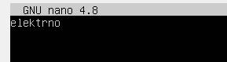
- MCEDIT (F2 save -> YES -> F10 quit)
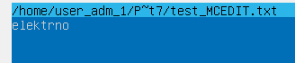

3. Using each of the three selected editors, open the file for editing, edit the file by replacing the nickname with the "21 School 21" string, close the file without saving the changes.

- VIM (i insert -> edit text -> ESC -> :q! -> ENTER)
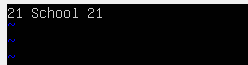
- NANO (CTRL+X -> N NO)
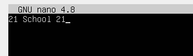
- MCEDIT (F10 quit -> NO)
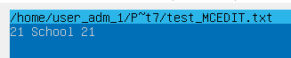

4. Using each of the three selected editors, edit the file again (similar to the previous point) and then master the functions of searching through the contents of a file (a word) and replacing a word with any other one.

- VIM (/text_search) | (:%s/visitor/not visitor)
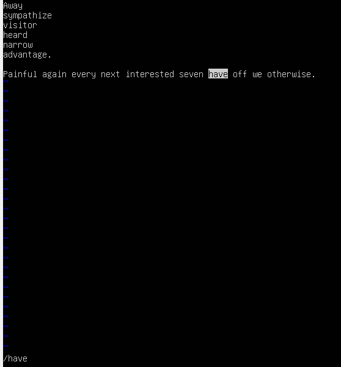
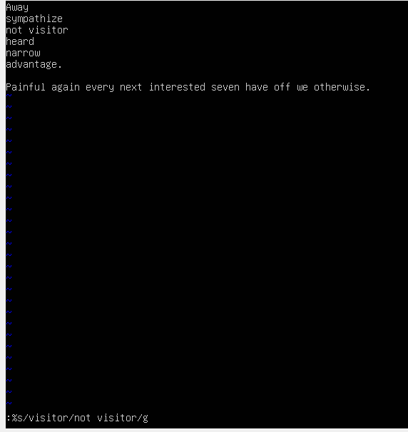
- NANO (CTRL+W -> search_text -> ENTER) | (ALT+R -> search_text -> ENTER -> new_text -> ENTER -> Y YES)
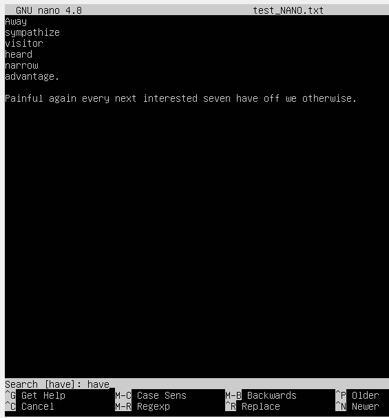
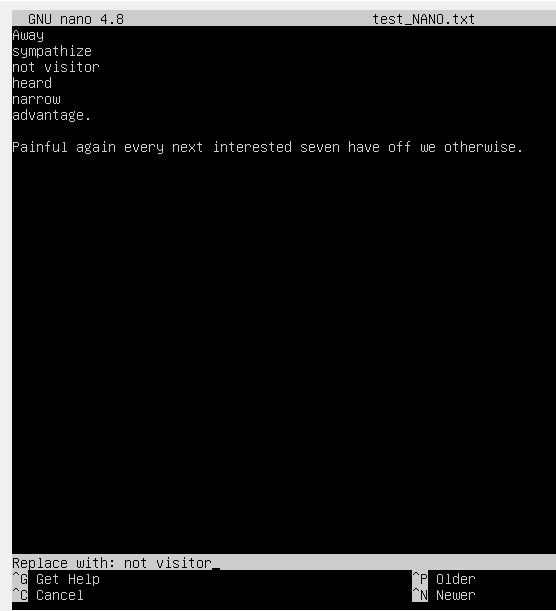
- MCEDIT (F7 -> search_text -> ENTER) | (F4 -> search_text -> TAB -> new_text -> * all charset -> ENTER -> Replace)
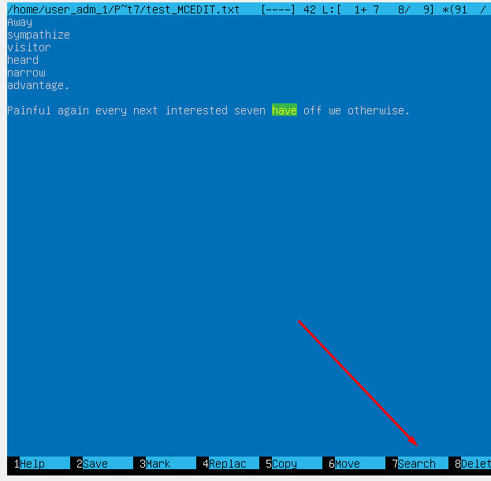
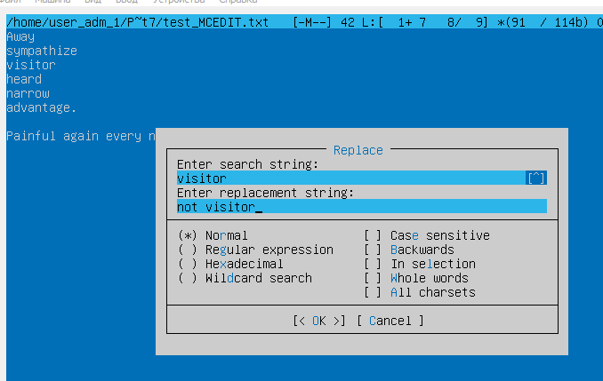